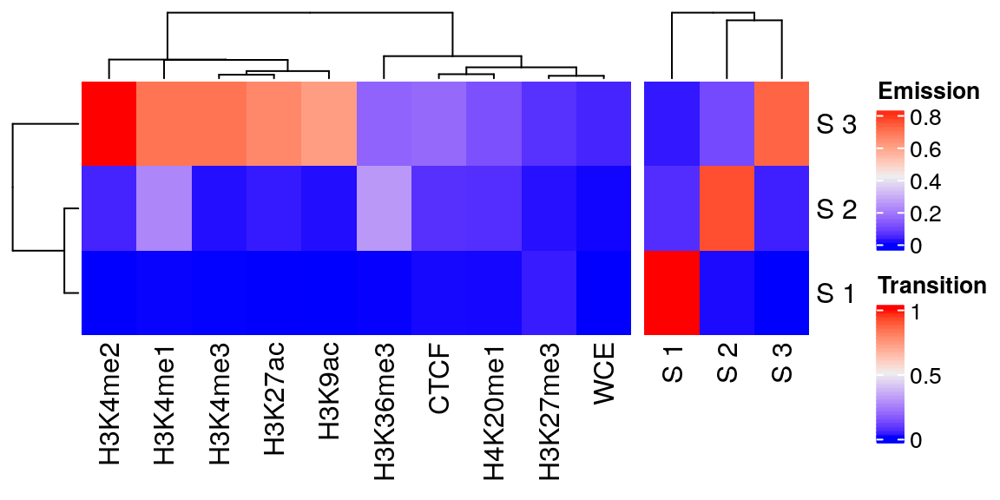
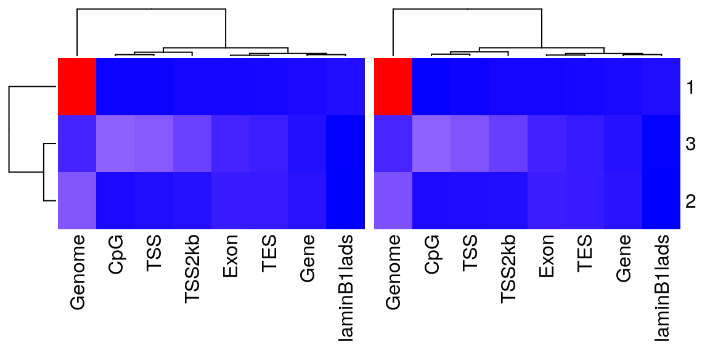
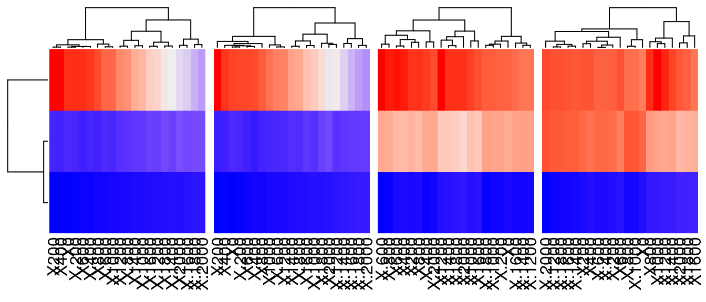
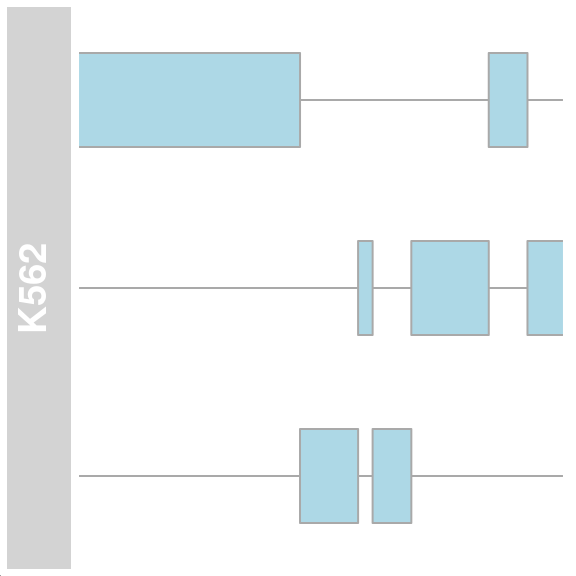
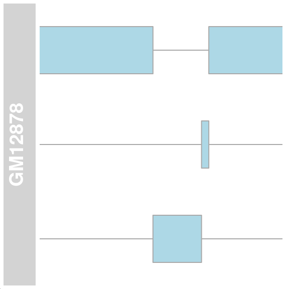
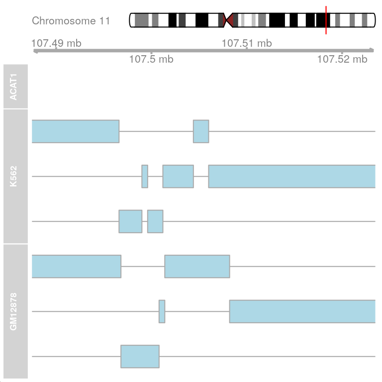
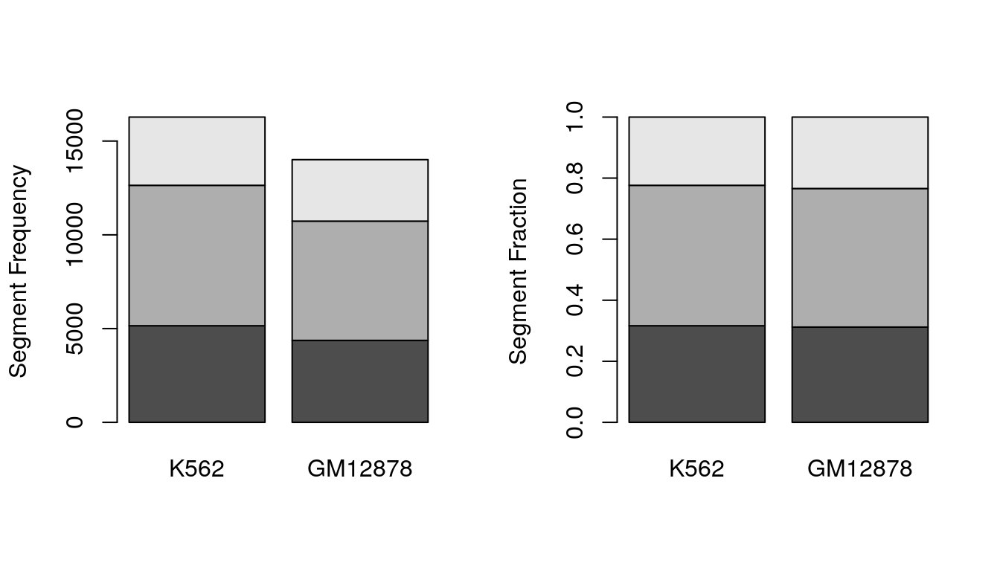
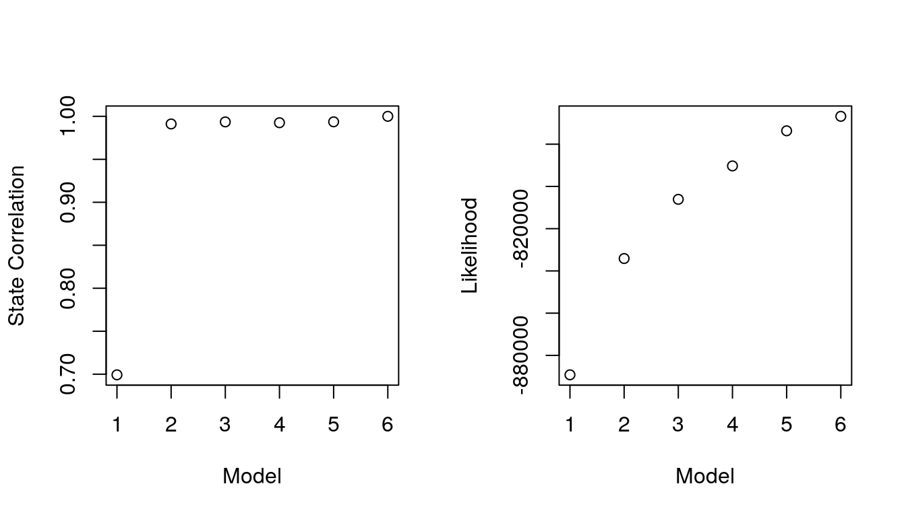

## Abstract

Chromatin segmentation analysis transforms ChIP-seq data into signals over the
genome. The latter represents the observed states in a multivariate Markov model
to predict the chromatin's underlying (hidden) states. *ChromHMM*, written in 
*Java*, integrates histone modification datasets to learn the chromatin states
de-novo. We developed an *R* package around this program to leverage the
existing *R/Bioconductor* tools and data structures in the segmentation analysis
context. `segmenter` wraps the *Java* modules to call *ChromHMM* and captures 
the output in an `S4` object. This allows for iterating with different 
parameters, which are given in *R* syntax. Capturing the output in *R* makes it
easier to work with the results and to integrate them in downstream analyses.
Finally, `segmenter` provides additional tools to test, select and visualize the
models.

### Keywords

Chromatin Segmentation, ChromHMM, Histone Modification, ChIP-Seq

## Methods

### Hidden Markov Models

Hidden Markov Models (HMM) assumes that a system (process) with unobservable or 
hidden states can be modeled with a dependent observable process. In applying
this model to segmentation analysis, the chromatin configurations are the hidden
states and they can be modeled using histone modification markers that are 
associated with these configurations [@Ernst2017].

### [ChromHMM](http://compbio.mit.edu/ChromHMM/)

*ChromHmm* is a Java program to learn chromatin states from multiple sets of 
histone modification markers ChIP-seq datasets [@Ernst2012]. The states are 
modeled as the combination of markers on the different regions of the genome. 
A multi-variate hidden Markov model is used to model the presence or absence of 
the markers. In addition, the fold-enrichment of the states over genomic 
annotation and locations is calculated. These models can be useful in annotating
genomes by showing where histone markers occur and interpreting this as a given
chromatin configuration. By comparing states between different cells or 
condition, one can determine the cell or condition specific changes in the 
chromatin and study how they might impact the gene regulation.

### This package!

The goal of the `segmenter` package is to

- Call *ChromHMM* using R syntax
- Capture the output in R objects
- Interact with the model output for the purposes of summarizing or visualizing

## Findings

### Segmentation analysis using `segmenter`

#### Inputs

ChromHMM requires two types of input files. Those are

- Genomic annotation files.
- Binarized signal files from the ChIP-seq data (Check the package vignette to 
see how to generate those)

ChromHMM contains pre-formatted files for commonly used genomes. We will
be using the human genome (hg18) which is available from the `chromhmmData` 
package.


```r
## load required libraries
library(segmenter)
library(Gviz)
library(ComplexHeatmap)
library(TxDb.Hsapiens.UCSC.hg18.knownGene)
```


```r
## coordinates
coordsdir <- system.file('extdata/COORDS',
                         package = 'chromhmmData')

list.files(file.path(coordsdir, 'hg18'))
```

```
## [1] "CpGIsland.hg18.bed.gz"    "laminB1lads.hg18.bed.gz" 
## [3] "RefSeqExon.hg18.bed.gz"   "RefSeqGene.hg18.bed.gz"  
## [5] "RefSeqTES.hg18.bed.gz"    "RefSeqTSS.hg18.bed.gz"   
## [7] "RefSeqTSS2kb.hg18.bed.gz"
```

```r
## anchors
anchorsdir <- system.file('extdata/ANCHORFILES',
                          package = 'chromhmmData')

list.files(file.path(anchorsdir, 'hg18'))
```

```
## [1] "RefSeqTES.hg18.txt.gz" "RefSeqTSS.hg18.txt.gz"
```

```r
## chromosomes' sizes
chromsizefile <- system.file('extdata/CHROMSIZES',
                             'hg18.txt',
                              package = 'chromhmmData')

readLines(chromsizefile, n = 3)
```

```
## [1] "chr1\t247249719" "chr2\t242951149" "chr3\t199501827"
```


```r
## locate input and output files
inputdir <- system.file('extdata/SAMPLEDATA_HG18',
                        package = 'segmenter')

list.files(inputdir)
```

```
## [1] "GM12878_chr11_binary.txt.gz" "K562_chr11_binary.txt.gz"
```

#### Model learning

The main function in `segmenter` is called `learn_model`. This wraps the the 
Java module that learns a chromatin segmentation model of a given number of 
states. In addition to the input files explained before, the function takes the
desired number of stats, `numstates` and the information that were used to 
generate the binarized files. Those are the names of the genome `assembly`, the
type of `annotation`, the `binsize` and the names of `cells` or conditions.


```r
## make an output director
outputdir <- tempdir()

## run command
obj <- learn_model(inputdir = inputdir,
                   coordsdir = coordsdir,
                   anchorsdir = anchorsdir,
                   outputdir = outputdir,
                   chromsizefile = chromsizefile,
                   numstates = 3,
                   assembly = 'hg18',
                   cells = c('K562', 'GM12878'),
                   annotation = 'RefSeq',
                   binsize = 200)
```

The return of this function call is the an S4 `segmentation` object, which we
describe next.

### Output `segmentation` Object

The `show` method prints a summary of the contents of the object. The three main
variables of the data are the states, marks and cells. The output of the 
learning process are saved in slots those are

- `model`: the initial and final parameters of the models
- `emission`: the probabilities of each mark being part of a given state
- `transition`: the probabilities of each state transition to/from another
- `overlap`: the enrichment of the states at every genomic features
- `TSS`: the enrichment of the states around the transcription start sites
- `TES`: the enrichment of the states around the transcription end sites
- `segment`: the assignment of states to every bin in the genome
- `bins`: the binarize inputs
- `counts`: the non-binarized counts in every bin

The last two slots are empty, unless indicated otherwise in the previous call. 
Counts are only loaded when the path to the `bam` files are provided.


```r
## show the object
show(obj)
```

```
## # An object of class 'segmentation' 
## # Contains a chromatin segmentation model:
## ## States: 1 2 3
## ## Marks: H3K27me3 H3K4me3 H3K9ac H3K27ac H3K4me2 WCE H3K4me1 CTCF H4K20me1 H3K36me3
## ## Cells: K562 GM12878
## # Contains nine slots: 
## ## model: use 'model(object)' to access
## ## emission: use 'emission(object)' to access
## ## transition: use 'transition(object)' to access
## ## overlap: use 'overlap(object)' to access
## ## TSS: use 'TSS(object)' to access
## ## TES: use 'TES(object)' to access
## ## segment: use 'segment(object)' to access
## ## bins: use 'bins(object)' to access
## ## counts: use 'counts(object)' to access
## # For more info about how to use the object, use ?accessors
```

For each slot, an accessor function with the same name is provided to access its
contents. For example, to access the emission probabilities call `emission` on
the object.

#### Emissions & transitions

Emission is the frequency of a particular histone  mark in a given chromatin 
state. Transition is the frequency by which a state (rows) transitions to 
another (column). These probabilities capture the spatial relationships between 
the markers (emission) and the states (transition).

To access these probabilities, we use accessors of the corresponding names. The
output in both cases is a matrix of values between 0 and 1. The emissions matrix
has a row for each state and a columns for each marker. The transition matrix
has a rows (from) and columns (to) for each state.


```r
## access object slots
emission(obj)
```

```
##        H3K27me3      H3K4me3       H3K9ac      H3K27ac      H3K4me2
## [1,] 0.02210946 0.0007877468 0.0002115838 0.0003912198 0.0003992906
## [2,] 0.01154739 0.0100515031 0.0093233199 0.0211596897 0.0330031299
## [3,] 0.05276061 0.6906489856 0.6030276625 0.6487866066 0.8252990950
##               WCE    H3K4me1        CTCF    H4K20me1   H3K36me3
## [1,] 0.0003263765 0.00150328 0.004697351 0.004263375 0.00121958
## [2,] 0.0034382153 0.21393308 0.052151182 0.048625137 0.24715916
## [3,] 0.0339041491 0.68908408 0.157048603 0.107478936 0.14438998
```

```r
transition(obj)
```

```
##              X1          X2          X3
## [1,] 0.99019055 0.008790184 0.001019266
## [2,] 0.05818283 0.907774152 0.034043020
## [3,] 0.02226795 0.114866997 0.862865050
```

The `plot_heatmap` takes the `segmentation` object and visualize the slot in 
`type`. By default, this is `emission`. The output is a `Heatmap` object from
the `ComplexHeatmap` package. These objects are very flexible and can be 
customized to produce diverse informative figures.


```r
## emission and transition plots
h1 <- plot_heatmap(obj,
                   row_labels = paste('S', 1:3),
                   name = 'Emission')

h2 <- plot_heatmap(obj,
                   type = 'transition',
                   row_labels = paste('S', 1:3),
                   column_labels = paste('S', 1:3),
                   name = 'Transition')
h1 + h2
```



Here, the `emission` and `transition` probabilities are combined in one heatmap.

#### Overlap Enrichemnt

The `overlap` slots contains the fold enrichment of each state in the genomic
coordinates provided in the main call. The enrichment is calculated by first 
dividing the number of bases in a state and an annotation and the number of 
bases in an annotation and in the genome. These values can be accessed and 
visualized using `overlap` and `plot_heatmap`.


```r
## overlap enrichment
overlap(obj)
```

```
## $K562
##   Genome.. CpGIsland.hg18.bed.gz RefSeqExon.hg18.bed.gz RefSeqGene.hg18.bed.gz
## 1 84.12164               0.44121                0.67556                0.89779
## 2 12.25670               0.83856                2.50467                1.61138
## 3  3.62166              14.52551                3.44377                1.30507
##   RefSeqTES.hg18.bed.gz RefSeqTSS.hg18.bed.gz RefSeqTSS2kb.hg18.bed.gz
## 1               0.72611               0.47881                  0.63069
## 2               2.35117               1.08139                  1.36524
## 3               2.78906              12.83038                  8.34190
##   laminB1lads.hg18.bed.gz
## 1                 1.13940
## 2                 0.25741
## 3                 0.27527
## 
## $GM12878
##   Genome.. CpGIsland.hg18.bed.gz RefSeqExon.hg18.bed.gz RefSeqGene.hg18.bed.gz
## 1 84.68675               0.36002                0.66630                0.87837
## 2 11.37758               1.02611                2.69113                1.74670
## 3  3.93567              14.69536                3.29165                1.45856
##   RefSeqTES.hg18.bed.gz RefSeqTSS.hg18.bed.gz RefSeqTSS2kb.hg18.bed.gz
## 1               0.74512               0.47684                  0.66201
## 2               2.43884               1.06522                  1.16491
## 3               2.32497              12.06876                  7.79610
##   laminB1lads.hg18.bed.gz
## 1                 1.12892
## 2                 0.27933
## 3                 0.30929
```

An important thing to note here is that the enrichment is calculated for each 
cell or condition separately and comparing these values between them can be 
very useful.


```r
## overlap enrichment plots
plot_heatmap(obj,
             type = 'overlap',
             column_labels = c('Genome', 'CpG', 'Exon', 'Gene',
                               'TES', 'TSS', 'TSS2kb', 'laminB1lads'),
             show_heatmap_legend = FALSE)
```



In this example, eight different types of coordinates or annotations were 
included in the call. Those are shown in the columns of the heatmap and the fold
enrichment of each state in the rows.

#### Genomic locations enrichment

A similar fold enrichment is calculated for the regions around the transcription
start (TSS) and end (TES) sits which are defined in the `anchordir` directory. 
Accessors of the same name and plotting functions are provided. These values are
also computed for each cell/condition separately.


```r
## genomic locations enrichment
TSS(obj)
```

```
## $K562
##       X.2000  X.1800  X.1600  X.1400  X.1200  X.1000    X.800    X.600    X.400
## [1,] 0.70688 0.68787 0.66703 0.64863 0.61553 0.58733  0.55667  0.52479  0.49843
## [2,] 2.01130 1.96501 1.85561 1.67047 1.62839 1.49375  1.32123  1.13609  0.98882
## [3,] 4.38597 4.98405 5.83846 6.89223 7.80360 8.91434 10.21019 11.57724 12.68798
##         X.200       X0     X200     X400     X600     X800    X1000    X1200
## [1,]  0.48494  0.47881  0.47513  0.48372  0.50456  0.52295  0.54012  0.55361
## [2,]  1.03090  1.08139  0.98461  0.92991  0.90466  0.94253  1.03931  1.26232
## [3,] 12.85886 12.83038 13.24334 13.22910 12.83038 12.27501 11.54876 10.48075
##        X1400   X1600   X1800   X2000
## [1,] 0.57752 0.59591 0.60695 0.61982
## [2,] 1.46009 1.69572 1.90190 2.06600
## [3,] 9.25610 8.03145 7.07736 6.22295
## 
## $GM12878
##       X.2000  X.1800  X.1600  X.1400  X.1200  X.1000   X.800    X.600    X.400
## [1,] 0.79777 0.77828 0.75331 0.72347 0.69303 0.64613 0.60229  0.55966  0.52373
## [2,] 1.50944 1.50944 1.46865 1.39612 1.27827 1.22841 1.14228  1.01989  0.77059
## [3,] 3.87878 4.29810 4.95330 5.80506 6.80096 7.95411 9.14658 10.41766 11.91151
##         X.200       X0     X200     X400     X600     X800    X1000    X1200
## [1,]  0.48597  0.47684  0.47379  0.49023  0.50180  0.51764  0.54139  0.55539
## [2,]  1.01989  1.06522  0.82498  0.87484  0.90204  0.96097  0.99270  1.07429
## [3,] 12.00324 12.06876 12.82879 12.33084 12.00324 11.49219 10.88940 10.35214
##        X1400   X1600   X1800   X2000
## [1,] 0.57914 0.60899 0.62299 0.63700
## [2,] 1.23294 1.38706 1.61370 1.81314
## [3,] 9.38245 8.29482 7.33823 6.46026
```

```r
TES(obj)
```

```
## $K562
##       X.2000  X.1800  X.1600  X.1400  X.1200  X.1000   X.800   X.600   X.400
## [1,] 0.71834 0.71481 0.71975 0.71975 0.72328 0.71834 0.71551 0.71128 0.71551
## [2,] 2.37056 2.41904 2.40934 2.42389 2.39965 2.39480 2.34632 2.36571 2.37056
## [3,] 2.90390 2.82187 2.73984 2.69062 2.69062 2.82187 3.05156 3.08437 2.96952
##        X.200      X0    X200    X400    X600    X800   X1000   X1200   X1400
## [1,] 0.71904 0.72611 0.72470 0.72893 0.72823 0.73247 0.74094 0.74235 0.74730
## [2,] 2.39965 2.35117 2.30269 2.25422 2.25422 2.24452 2.20089 2.15241 2.14272
## [3,] 2.78906 2.78906 2.98593 3.05156 3.06796 3.00234 2.95312 3.08437 3.00234
##        X1600   X1800   X2000
## [1,] 0.74942 0.75012 0.76001
## [2,] 2.16211 2.12333 2.05546
## [3,] 2.88749 3.00234 3.00234
## 
## $GM12878
##       X.2000  X.1800  X.1600  X.1400  X.1200  X.1000   X.800   X.600   X.400
## [1,] 0.72407 0.73038 0.73249 0.73389 0.72968 0.73389 0.73319 0.74161 0.74161
## [2,] 2.51717 2.48062 2.47017 2.46495 2.48584 2.50151 2.50151 2.42317 2.42317
## [3,] 2.55143 2.52123 2.50614 2.49104 2.52123 2.38536 2.40046 2.44575 2.44575
##        X.200      X0    X200    X400    X600    X800   X1000   X1200   X1400
## [1,] 0.74442 0.74512 0.73950 0.74582 0.75284 0.76757 0.77038 0.77459 0.77669
## [2,] 2.39706 2.43884 2.41795 2.37095 2.31350 2.16728 2.12550 2.10983 2.12028
## [3,] 2.46085 2.32497 2.50614 2.50614 2.52123 2.62692 2.68730 2.64201 2.56653
##        X1600   X1800   X2000
## [1,] 0.79353 0.79283 0.79563
## [2,] 2.06805 2.04194 2.00538
## [3,] 2.35517 2.44575 2.49104
```


```r
## genomic locations enrichment plots
h1 <- plot_heatmap(obj,
                   type = 'TSS',
                   show_heatmap_legend = FALSE)
h2 <- plot_heatmap(obj,
                   type = 'TES',
                   show_heatmap_legend = FALSE)

h1 + h2
```



#### Segments

The last model output is called `segment` and contains the assignment of the 
states to the genome. This is also provided for each cell/condition in the form
of a `GRanges` object with the chromosome name, start and end sites in the 
ranges part of the object and the name of the state in a metadata columns.


```r
## get segments
segment(obj)
```

```
## $K562
## GRanges object with 16280 ranges and 1 metadata column:
##           seqnames              ranges strand |       state
##              <Rle>           <IRanges>  <Rle> | <character>
##       [1]    chr11             0-50800      * |          E1
##       [2]    chr11         50800-52400      * |          E2
##       [3]    chr11         52400-57800      * |          E1
##       [4]    chr11         57800-58000      * |          E2
##       [5]    chr11         58000-58200      * |          E3
##       ...      ...                 ...    ... .         ...
##   [16276]    chr11 134227400-134243000      * |          E1
##   [16277]    chr11 134243000-134244200      * |          E2
##   [16278]    chr11 134244200-134450800      * |          E1
##   [16279]    chr11 134450800-134451600      * |          E2
##   [16280]    chr11 134451600-134452200      * |          E3
##   -------
##   seqinfo: 1 sequence from an unspecified genome; no seqlengths
## 
## $GM12878
## GRanges object with 14009 ranges and 1 metadata column:
##           seqnames              ranges strand |       state
##              <Rle>           <IRanges>  <Rle> | <character>
##       [1]    chr11             0-66800      * |          E1
##       [2]    chr11         66800-67600      * |          E2
##       [3]    chr11        67600-116200      * |          E1
##       [4]    chr11       116200-116400      * |          E3
##       [5]    chr11       116400-117000      * |          E2
##       ...      ...                 ...    ... .         ...
##   [14005]    chr11 133963800-134243400      * |          E1
##   [14006]    chr11 134243400-134244200      * |          E2
##   [14007]    chr11 134244200-134450800      * |          E1
##   [14008]    chr11 134450800-134451600      * |          E2
##   [14009]    chr11 134451600-134452200      * |          E3
##   -------
##   seqinfo: 1 sequence from an unspecified genome; no seqlengths
```

To visualize these segments, we can take advantage of Bioconductor annotation
and visualization tools to subset and render a visual representation of the 
segments on a given genomic region.

As an example, we extracted the genomic coordinates of the gene 'ACAT1' on 
chromosome 11 and resized it to 10kb around the transcription start site. We
then used `Gviz`'s `AnnotationTrack` to render the ranges as tracks grouped by
the `state` column in the `GRanges` object for each of the cell lines. 


```r
## gene gene coordinates
gen <- genes(TxDb.Hsapiens.UCSC.hg18.knownGene,
             filter = list(gene_id = 38))

## extend genomic region
prom <- promoters(gen,
                  upstream = 10000,
                  downstream = 10000)

## annotation track
segs1 <- segment(obj, 'K562')
atrack1 <- AnnotationTrack(segs1$K562,
                          group = segs1$K562$state,
                          name = 'K562')

segs2 <- segment(obj, 'GM12878')
atrack2 <- AnnotationTrack(segs2$GM12878,
                          group = segs2$GM12878$state,
                          name = 'GM12878')

## plot the track
plotTracks(atrack1, from = start(prom), to = end(prom))
```



```r
plotTracks(atrack2, from = start(prom), to = end(prom))
```



Other tracks can be added to the plot to make it more informative. Here, we used

- `IdeogramTrack` to show a graphic representation of chromosome 11
- `GenomeAxisTrack` to show a scale of the exact location on the chromosome
- `GeneRegionTrack` to show the exon, intron and transcripts of the target gene

Those can be put together in one plot using `plotTracks`


```r
## ideogram track
itrack <- IdeogramTrack(genome = 'hg18', chromosome = 11)

## genome axis track
gtrack <- GenomeAxisTrack()

## gene region track
data("geneModels")
grtrack <- GeneRegionTrack(geneModels,
                           genom = 'hg18',
                           chromosome = 11,
                           name = 'ACAT1')

## put all tracks together
plotTracks(list(itrack, gtrack, grtrack, atrack1, atrack2),
           from = min(start(prom)),
           to = max(end(gen)),
           groupAnnotation = 'group')
```



Moreover, we can summarize the segmentation output in different ways to either
show how the combination of chromatin markers are arranged or to compare 
different cells and condition.

One simple summary, is to count the occurrence of states across the genome.
`get_frequency` does that and returns the output in tabular or graphic formats.


```r
## get segment frequency
get_frequency(segment(obj), tidy = TRUE)
```

```
##   state frequency    cell
## 1    E1      5150    K562
## 2    E2      7489    K562
## 3    E3      3641    K562
## 4    E1      4371 GM12878
## 5    E2      6359 GM12878
## 6    E3      3279 GM12878
```

The frequency of the states in each cell can also be normalized by the total 
number of states to make comparing across cell and condition easier.


```r
## frequency plots
par(mfrow=c(1, 2))
get_frequency(segment(obj),
              plot = TRUE,
              ylab = 'Segment Frequency')

get_frequency(segment(obj),
              normalize = TRUE,
              plot = TRUE,
              ylab = 'Segment Fraction')
```



### Comparing models

To choose a model that fits the data well, one can learn multiple models with 
different parameters, for example the number of states and compare them. In this
example, we will be calling `learn_model` several times using `lapply` with the 
same inputs except the number of states (`numstates`). The output would be a
list of `segmentation` objects. `segmenter` contain functions to do basic 
comparison between the models.


```r
## relearn the models with 3 to 8 states
objs <- lapply(3:8,
    function(x) {
      learn_model(inputdir = inputdir,
                   coordsdir = coordsdir,
                   anchorsdir = anchorsdir,
                   chromsizefile = chromsizefile,
                   numstates = x,
                   assembly = 'hg18',
                   cells = c('K562', 'GM12878'),
                   annotation = 'RefSeq',
                   binsize = 200)
    })
```

- `compare_models` takes a list of `segmentation` objects and returns a vector
with the same length. The default is to compare the correlation between the
emission parameters of the states in the different models. Only the correlations
of the states that has the maximum correlation with one of the states in the
biggest model is returned.


```r
## compare the models max correlation between the states
compare_models(objs)
```

```
## [1] 0.6992815 0.9911192 0.9935068 0.9925634 0.9936017 1.0000000
```

- The other value to compare is the likelihood of the models which can be 
indicated through the `type` argument.


```r
## compare the models likelihood
compare_models(objs, type = 'likelihood')
```

```
## [1] -889198.8 -834128.3 -806108.9 -790283.4 -773662.1 -766802.5
```

Setting `plot = TRUE` returns a plot with data points corresponding to the 
models in the list. 


```r
## compare models plots
par(mfrow = c(1, 2))
compare_models(objs,
               plot = TRUE,
               xlab = 'Model', ylab = 'State Correlation')
compare_models(objs, type = 'likelihood',
               plot = TRUE,
               xlab = 'Model', ylab = 'Likelihood')
```



As the number of states increases, one of the states in the smaller model would
be split into more than one and its emission probabilities would have higher 
correlations with the states in the larger model.

## Concluding remarks

To conclude, the chromatin states models 

- Emissions and transition probabilities show the frequency with which histone 
marker or their combination occur across the genome (states). The meaning of 
these states depends on the biological significance of the markers. Some markers
associate with particular regions or (e.g. promoters, enhancers, etc) or 
configurations (e.g. active, repressed, etc).
- Fold-enrichment can be useful in defining the regions in which certain states
occur or how they change in frequency between cells or conditions.
- The segmentation of the genome on which these probabilities are defined can be
used to visualize or integrate this information in other analyses such as 
over-representation or investigating the regulation of specific regions of 
interest.

### **Availability of supporting source code and requirements**

List the following:

-   Project name: segmenter
-   Project home page: https://github.com/MahShaaban/segmenter
-   Operating system(s): Platform independent
-   Programming language: R
-   Other requirements: R 4.1 or higher
-   License: GPL-3

### Declarations

#### Competing interests

The authors declare no conflict of interest.

#### Funding

This work was supported by the National Research Foundation of Korea (NRF) grant
funded by the Ministry of Science and ICT (MSIT) of the Korea government 
[2015R1A5A2008833 and 2020R1A2C2011416].

#### Author contributions

Mahmoud Ahmed developed and maintains the package. Deok Ryong Kim supervised 
the project.

### References
